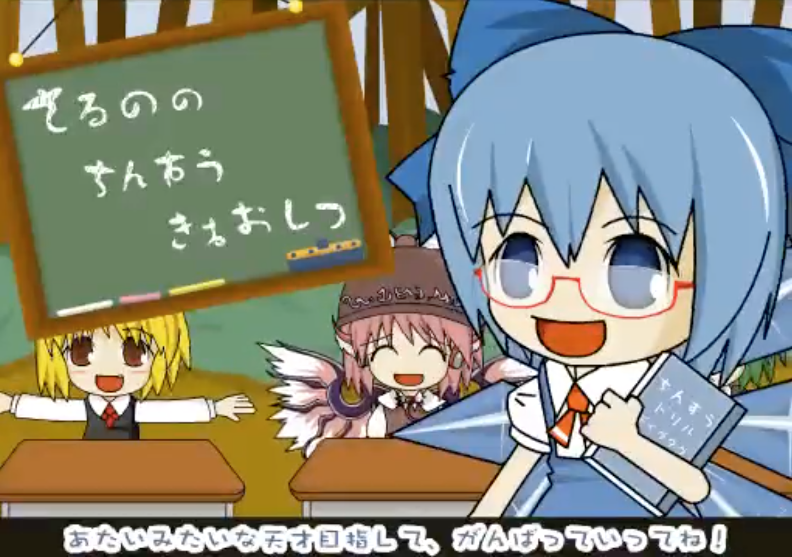
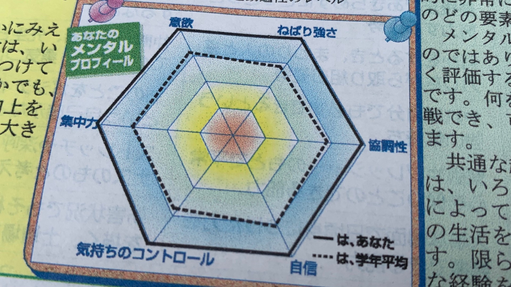
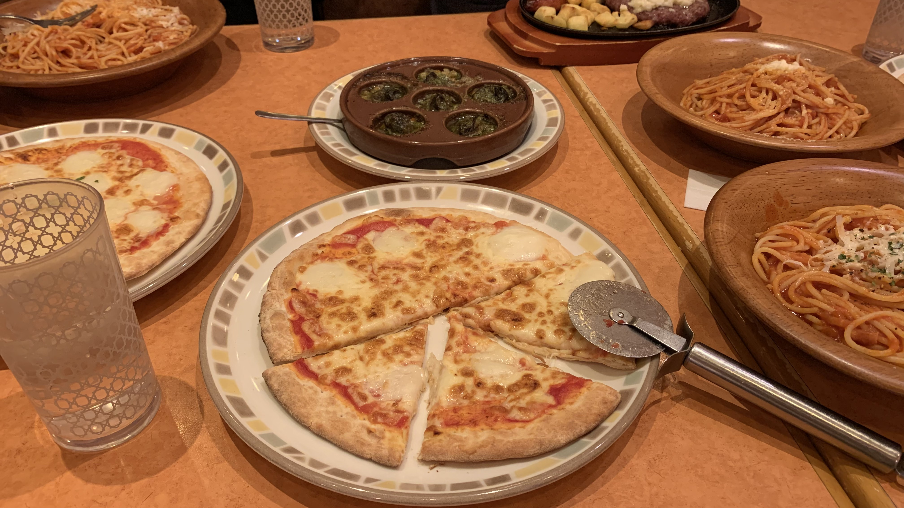

 

いきなりですけどね、僕って天才なんですよ、**て　ん　さ　い 。**　ﾆﾎﾝｺﾞﾜｶﾘﾏｽｶ??

学校に遅刻しなかったり、ロボットにたくさんLEDつけたり、物理で98点取ったり。まじで天才すぎる、天才すぎて怖い。ジーニアスじゃね？

基本的にテンションはこんな感じ。

日本人ってさ、なんか謙遜する傾向若干あるやん？なんかいいなーってものがあって声かけたりしても「いやまだまだです…。」「上には上がいるので…」とかいう人多いよね。

考え方色々あると思うけど、別に他の人のものと比べて自分を低く見せる必要ないじゃん？**すごいものはすごいんだよ。**すごーい。ぱちぱち

正直ね、自分の周りやついった王国を見てると自分よりすごい人なんてめちゃくちゃ多いし、ビビることもある。でもそんなこと気にして自信無くしたって意味ないじゃん？せめて自分のことくらいは自分で認めてあげまっちょ

プラス思考まじ大事だと思う、自分はこの性格のおかげで全国大会前日にロボットのマイコン5つ焼いたりしても諦めずに次の日の試合に間に合わせたりすることができたし、割とジーニアス。むしろ焼けたのが当日じゃなくて前日じゃなくてよかった。

これは新体力テストの判定票に載ってた僕のメンタルプロフィール、やばすぎ。

というわけで、皆さんも自己肯定感高く持って楽しく生きていきましょう。

自分を認めるのなんてマジで小さいことからでいい。朝起きれたとか課題提出間に合ったとか、逃げずにレポートを終わらせたとか。**そのレベルでもできたあなたはもうすでにじーにあす。**神〜♪

あっ、そういえば今日サイゼ行ったんだけど美味かった。

綺麗にπ/3ずつに分けれてるでしょ？r×cos π/3 = r/2になることを利用すると簡単に綺麗に分けられるよ。がち天才じゃね？

あと、話変わるけど今日近くのドラッグストアで買ったのど飴がクソうまい。みんなも食べてみてね。おわり