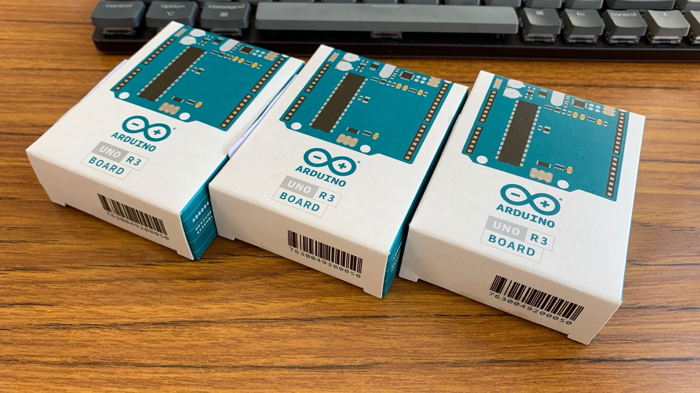

 

みなさんごきげんよう。

今週は補講日が多かったのでほぼ休みだった。普段は服役5日+休日2日だけど今週はそれが逆転。月曜日と水曜日だけ学校に行けばよかった。さいこう

> **補講日って？** 
> 講義の数合わせのための予備日。日頃の行いがいいと休みになって、日頃の行いが悪いと全部埋まる。俺は日頃の行いがよかったからやすみ。小中高生乙！！！！！

みてみてーこれはArduino。大人向けレゴだよ。

かわいいね。そーveryきゅートってかんじ❤️

今日と明日の休みが終わると一気に試験週間に近づくって考えたらかなしい気持ちになる。後期になってからほぼ全部講義寝てたからマジでやばい。個人的にやばいのはうえはらの科学とのもさんの電子制御設計製図。有機化学なんもわからん。だれかたすけて

ということで最近脳がボルボックスになりました。おわり