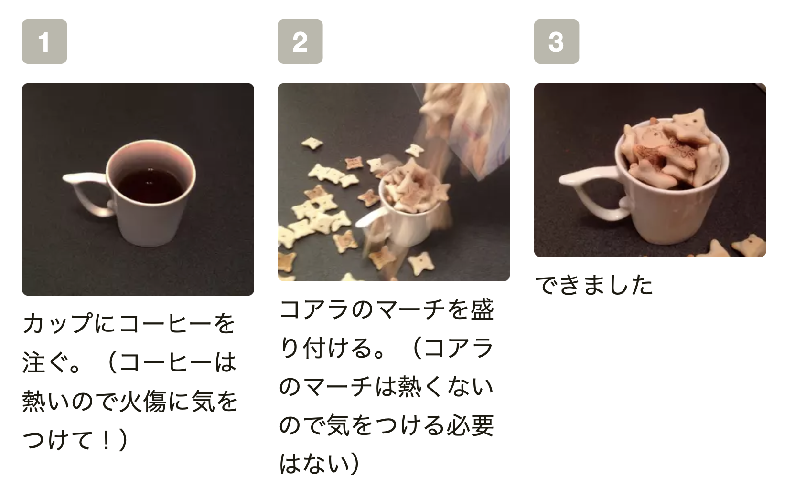
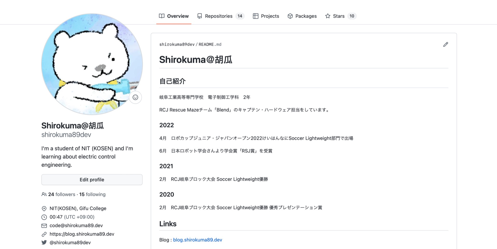
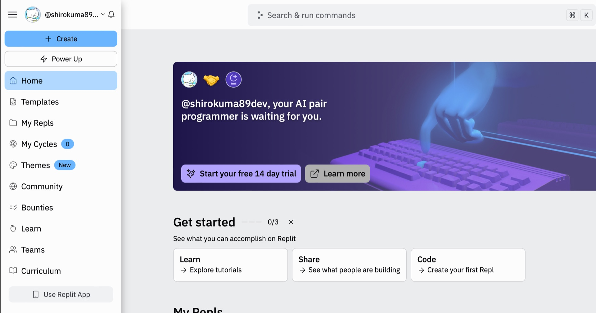
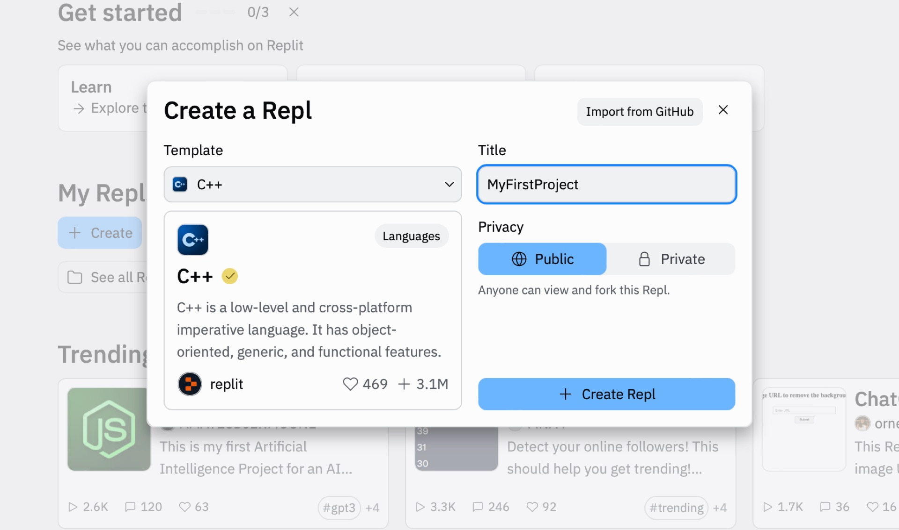
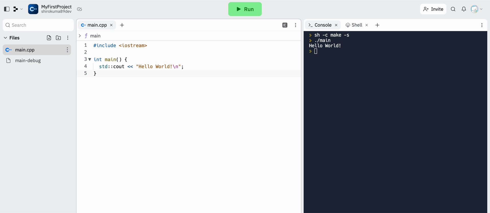
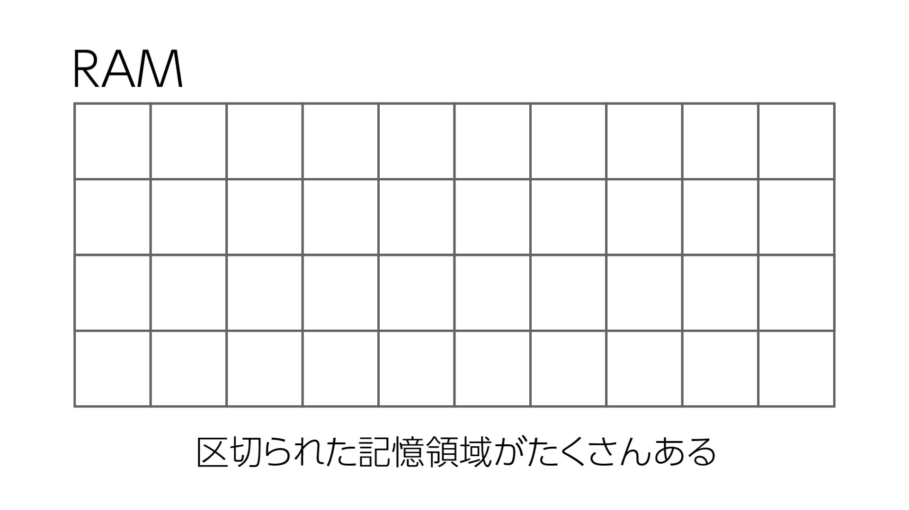
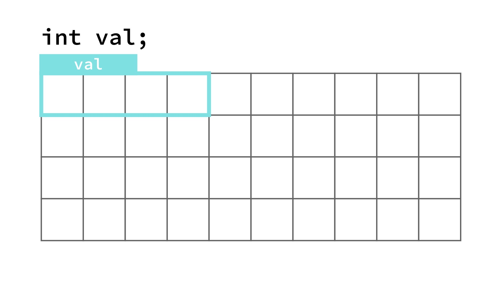
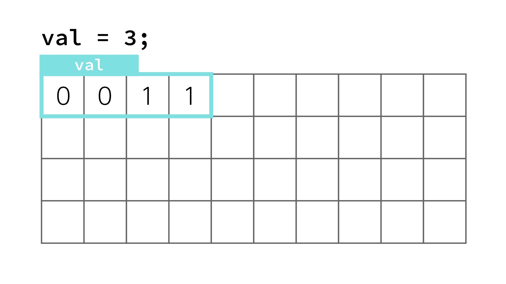
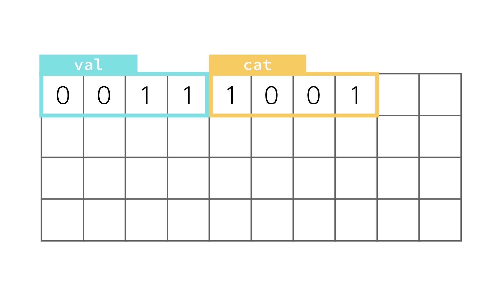
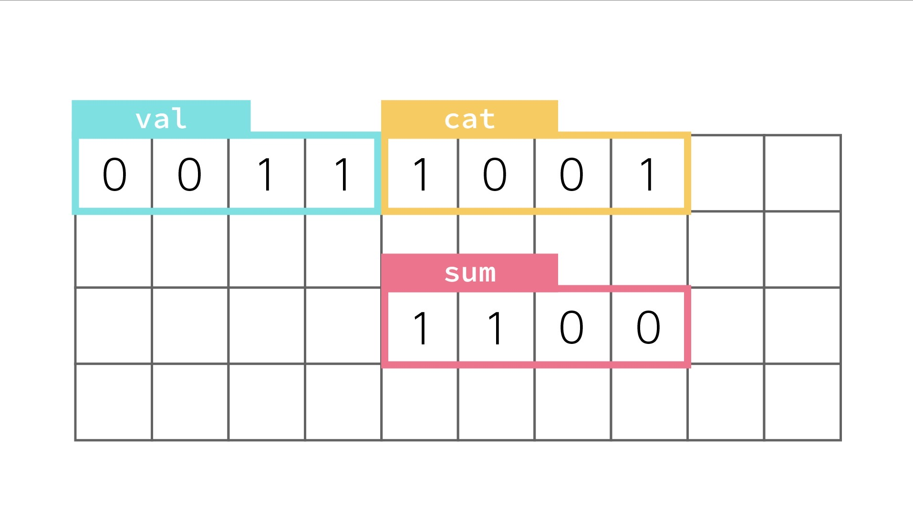

<br>


## 講習を始める前に

### 燃やすことを恐れないこと

半導体を燃やした数だけ人は強くなれます

### まず調べること

何かわからないことがあった時に、まず人に聞こうとする人が結構います。あと数分調べてわからなかったから聞くみたいなやつも。

知識ベースの不明点はネットをググれば大体出てきます。**15分死に物狂いで調べてから**人に質問しましょう。質問する相手の時間だって無限ではありません。

ただし講習時間中（CCRにいる時間中）は例外で任意のタイミングでチャットで聞いてください。すぐにわからない点を共有したいので。よろしくお願いします。（全体の進行を止めないようにチャットでね！）

### Done is better than perfect.

完璧かどうかなんてどうでもいいのでまず手を動かして動くもの作ってみましょう。その結果燃えたとしても学びです。

## todayの到達目標

**一通りC/C++を扱えるようになる!!!**

今日はこんなプログラムが作れるようになります。

```c
#include <stdio.h>

int main(void) {
    int N = 100;

    if (N < 1) {
        printf("error");
        return 0;
    }

    int sumOf1toN = 0;

    for (int i = 0; i < N ; i++){
        sumOf1toN += (i + 1);
    }

    printf("%d", sumOf1toN);
    
    return 0;
}
```


逆にこれが理解できて、実行結果の想像がつく方は今日は多分帰っても大丈夫です。お疲れ様でした。

STM32の方に時間を割きたいので、時間の都合上C言語に関しては新快速で進めます。はち切れそうな焼売みたいにどんどん知識を詰め込んでいくので、こぼれた分は冬休み中に読み直したりネットで調べたりして回収してください。

わからないことがあれば、冬休み中に白熊に質問してください。午前中は多分寝てるので、あんまり即レスは期待しないようにだけよろしくお願いします。

## プログラミング is 何

やることリストです。料理をするときに、何も手順書がないとどのように作ればいいかわからないのと同じです。プログラムには必ず順序に沿って進められます。逆戻りすることはないのでこの概念を忘れないようにしてください。



<center>正しく料理するためにはレシピという指南書が必要です。</center>

<br>

出典: [cookpad](https://cookpad.com/recipe/2561889)
## GitHubのアカウントをつくろう

Web上でプログラムを管理できるGitHubというサービスがあります。使い方についてはまた後日扱いますが、このアカウントを一つ持っておくだけでいろいろなDeveloper向けのサービスにログインできるようになるので持ってて損はないです。


特にこだわりがなければ学校のメールアドレスでアカウント作っちゃってください。（もし気に入らなくなったら何回でも変更できます。）

こんな感じにプロフィールページができたら成功です。（これは僕のやつです。）



## replitで環境構築

プログラムの動作環境として今回は環境構築が必要ないオンライン環境を用います。paizaとか色々ありますが、色々試した中ではreplitが一番使いやすかったので今回はこれを用います。


[replitのリンク](https://replit.com)

Start creating→Continue with Githubでサインインしてください。するとGitHub側から認証を求められるので認証を完了してください。



こんな感じになりましたか？では左上のCreateを押して新規作成します。TemplateはC++、タイトルは自由に決めて下さい。できたらCreate Replで**☆確定☆**します。



画面左半分がエディタ、右半分がコンソール（プログラムの実行エリア）です。



試しに上部のRunを押してみましょう。プログラムが実行され、右半分のところに以下のように表示されたら成功です。

```
> sh -c make -s
> ./main
> Hello World!
```

## 基礎文法

プログラムの基本中の基本を以下に列挙します；

- 上から下へ流れる
- 文末には;の記号がつく

これが理解できてないと始まらないので頭に叩き込みませう。

## 何もしないプログラムを作ろう

では今からC言語で書ける最小のプログラムを書きましょう。以下のプログラムをエディタ内に入力してください。

```c
int main(void) {
    return 0;
}
```

できたらRunを押して実行してください。

```
> 
```

このように表示されれば（何も表示されてないですが）成功です。

### 解説

C言語はmain関数と呼ばれる領域の中に書かれたコードが実行される仕様になっています。

```c
int main(void) {
    //ここから

    //ここまで
    return 0;
}
```

この場合、中に何も入っていないので何も実行されません。

```c
int main(void) {
```

はmain関数の始まりを表しています。

```c
    return 0;
}
```

はmain関数の終わりを表しています。

> **⚠️エラーが出ましたか？**<br>
> 以下の点をまず確認してください；
> - 綴りは間違えていませんか？
> - 全角文字は使っていませんか？半角しか使えませんよ
> - セミコロン;は打ちましたか？
> - intとmainの間にスペースが適切にありますか？

## エラーを質問するときは

エラー内容とコードをそのまんま**全部**送ってください。スクショを見やすいようにとトリミングしてくれる人がいますが、受け取る側の情報量が減るだけでなにもメリットがないので**画面全体を丸ごとスクショしたものをトリミングせずにチャットで質問するように！！**

## 画面に文字列を表示する

以下のコードを書いて実行してください。

```c
#include <stdio.h>

int main(void) {
    printf("I love coding!");
    return 0;
}
```

実行結果が以下になるはずです。

```
I love coding!
```

### stdio.h

C言語はデフォルトだと本当に機能が何もないので、標準入出力（STanDard Input/Output）機能を有効にしてやる必要があります。

```c
#include <stdio.h>
```

と先頭に一行追加することで、入出力機能（ユーザーから情報を受け取ったり、逆に出力したり）が解放されます。

### printf関数

文字列を表示できます。文字列はダブルクオーテーション""で必ず囲む必要があります。

```c
printf("You can write here!");
```

> **🈲エラーが出ましたか？**<br>
> 以下の点をまず確認してください；
> - 綴りは間違えていませんか？
> - 文字列をダブルクオーテーションで囲いましたか？
> - セミコロン;は打ちましたか？
> - printfではなくprintになっていませんか？

改行したい場合は\nを用います。

```c
#include <stdio.h>

int main(void) {
    printf("I love\nMONSTER ENERGY DRINK!");
    return 0;
}
```

```
I love
MONSTER ENERGY DRINK!
```

## 課題1

実行結果が以下になるプログラムを書いてください。

```
cat tree egg
GitHub banana
```

## 変数

C言語には変数という概念があり、変数を用いると計算結果などを一時的に保存することができます。

パソコンには一時的にデータを保管するための領域であるRAMが搭載されています。イメージはこんな感じ。



この一つ一つのますに0か1を保存できると思ってください。ではこの領域に記憶してみたいので、`val`という名前で領域を確保します。

```c
int val;
```

と記述することでRAMにvalという名前の領域を確保できます。RAMのどこに確保されるかはパソコン側が決定するので**僕たちが何か気にしてあげる必要はありません。**



これを**変数valを宣言する**といいます。変数宣言の文法はこんな感じです。
```c
int valiableName;
```

`int`は整数を表しています。つまり`int`で宣言された変数には整数を保存することができます。変数の名前は自由に決めちゃって大丈夫です。

> **いとをかしな変数名**<br>
> 変数名はなんの変数なのかわかりやすくつけるべきです。一昔前はエディタがメモ帳みたいな~~かす~~だったのでとにかく短い名前をつける人が多かったのですが、意味が分かりにくいだけなので避けた方がいいと個人的には思うなぁ。
> ```c
> //いい変数名の例
> int currentMotorSpeed;//現在のモーターのスピード
> int isButtonPushed;   //ボタンが押されているか
>
> //よくない変数名の例
> int tensu;    //scoreとかあったやろ
> int n;        //オワコン。なんのnなん？しね
> int hogehoge; //意味のない単語にしない
> ```
> 長い変数名がいいってわけじゃないです。最低限それをみた時に何かわかるくらいの変数名にすべきだと思います。これまじ

### 代入してみよう

今のままだとRAMの領域を確保しただけで、何も活用できていません。混み合ってるフードコートで鞄置いて席取りしてる奴と同じです。

ということで変数に数字を記憶させてみます。

```c
val = 3;
```

これはvalの領域に3という数字を記憶する命令です。実際のメモリの内容は0と1だけで表されていますが、その辺はパソコン側が勝手に変換してくれるので僕たちは気にする必要はありません。

ここでいう=の記号が数学の=記号とは意味が異なることに注意してください。右から左へ数値を渡す記号が=です。3という数字を変数valへ渡しています。**右から左です。**



これを**変数valに3を代入した**といいます。

ではint型の変数catに9を代入してみます。

```c
int cat;
cat = 9;
```

この時RAMの中身はこうなっています。今回はcatがvalの隣に確保されましたようですがいつも隣とは限りません。その辺はパソコン側が都合の良い場所を自動的に決定します。



## 課題2

先ほどの

```c
#include <stdio.h>

int main(void) {
    //ここに書いてね↓
    printf("I love\nMONSTER ENERGY DRINK!");
    return 0;
}
```

のプログラムのprintf関数の前で、変数dogを宣言して2を代入してください。

## 演算

足し算引き算掛け算割り算をしませう。

足し算の記号は+, 引き算の記号は-, 掛け算の記号は*, 割り算の記号は/です。

先ほどのvalとcatを足した値をsumに代入するプログラムを作ってみます。



```c
int main(void) {
    int val;
    int cat;

    val = 3;
    cat = 9;

    sum = val + cat;//ここで計算してる！！！

    return 0;
}
```

このプログラムが終了する瞬間、変数sumは12になってるはずです。おけい？

一般的な数学と同じように、掛け算と割り算の計算が優先されます。計算順序を明示したい場合は()で囲ってあげるとそちらを優先的に計算します。

```c
int main(void) {
    int val;
    int cat;

    val = 3;
    cat = 9;

    sum = val * (3 + cat);//3 + catをしてからvalを掛ける

    return 0;
}
```

## 課題3

```c
int main(void) {
    int val;
    int cat;
    int dog;

    val = 8;
    cat = 3;
    dog = 4;

    int sum = dog + (val - cat) * dog;

    return 0;
}
```

を実行した時に、sumに代入される数字が何かを答えなさい。

## 変数の中身を表示しよう

せっかく計算したんだからsumの中身を画面に出力したいですよね？したいですよね？？？？？

以下のように書くことで変数の中身を表記することができます。

```c
printf("%d", valiableName);
```

では実際にプログラムを書いてみましょう。以下のプログラムをエディタに書いて実行してください。

```c
#include <stdio.h>

int main(void) {
    int val;
    val = 5;

    printf("%d", val);
    return 0;
}
```

実行結果

```
5
```

> **😇エラーが出ましたか？**<br>
> 以下の点をまず確認してください；
> - 綴りは間違えていませんか？
> - %が&とかになっていませんか？
> - セミコロン;は打ちましたか？
> - printf関数の中の,を忘れていませんか？

## 課題4

課題3のプログラムに一行付け足して変数sumの中身を表示してください。

## for文

x回繰り返すという処理ができるようになります。以下のプログラムをエディタに書いて実行してください。

```c
#include <stdio.h>

int main(void) {
    for (int i = 0; i < 10; i++) {
        printf("merry christmas!\n");
    }
    return 0;
}
```

実行結果

```
merry christmas!
merry christmas!
merry christmas!
merry christmas!
merry christmas!
merry christmas!
merry christmas!
merry christmas!
merry christmas!
merry christmas!
```

狂気みたいなプログラムができましたね。こんな感じで回数指定繰り返しプログラムを作れるようになります。

> **😱エラーが出ましたか？**<br>
> 以下の点をまず確認してください；
> - for文のなかの;を忘れていませんか？
> - {}が()や[]になっていたりしませんか？

多分すぐできると思いますが、このプログラムを書き換えて5回merry christmas!と表示するプログラムに書き換えてください。何処を書き換えればいいか想像がつきますか？試行錯誤してみてください。

### for文の文法

```c
for (int i = 0; i < 回数; i++) {
    //繰り返ししたいもの
}
```

iじゃなくてjでもkでもなんでもいいのですが、慣習的にiが使われることが多いようです。ちょっと長めで覚えにくいですが、**覚えてください。**

このiのことを**カウンタ**といいます。

## 課題5

Happyと7回表示するプログラムを作ってください。

## 課題6

Happyと7回表示した後にSmileと2回表示するプログラムを作ってください。

## iの中身を表示してみよう

このプログラムをエディタに書いて実行してください。

```c
#include <stdio.h>

int main(void) {
    for (int i = 0; i < 8; i++) {
        printf("%d", i);
    }
}
```

実行結果

```
01234567
```

for文はループが実行しおわるたびにiの値が1ずつ増えていく仕様になっています。iはあくまで変数なので、ループの中の任意の場所で活用できます。

```c
#include <stdio.h>

int main(void) {
    for (int i = 0; i < 8; i++) {
        printf("%d", (i + 1) * 2);
    }
}
```

だとどうなるか想像がつきますか？実行して想像と合っているか確かめてみてください。

## switch文

なくてもプログラム書けるので飛ばします

## continue文

使えない子なので飛ばします

## 供養画像

作っては見たもののあんまり面白くなかった画像の供養です。見る必要ない

